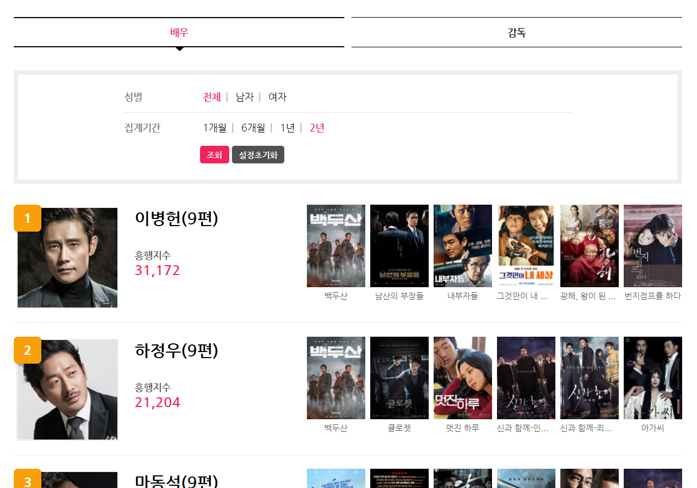
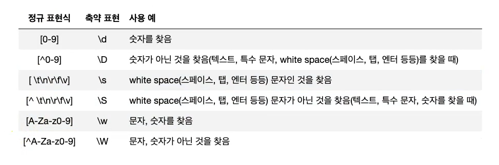
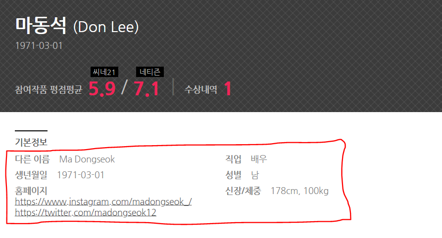
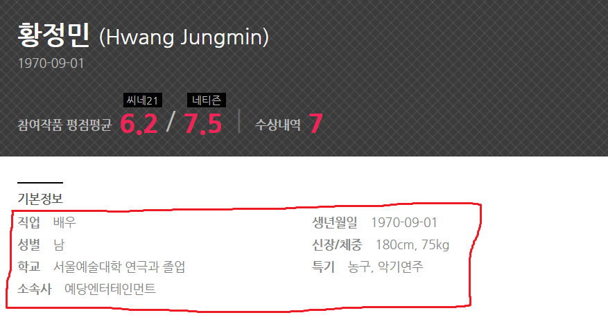

# MongoDB 저장을 위한 데이터 크롤링
## 1. 사이트 선택
cine21 배우 랭킹 사이트 크롤링
  - 사이트 주소: http://www.cine21.com/rank/person/
  - 요청 방식 확인 방법: 크롬 개발자 모드로 들어가서, Network -> content 페이지의 요청 방식 확인
    - Request URL: http://www.cine21.com/rank/person/content
    - Request Method: POST
    - Form data
      - section = 'actor'
      - period_start = '2018-08'
      - gender = 'all'
      - page = 3 


## 2. 크롤링 준비
### 라이브러리 import
```python
from bs4 import BeautifulSoup
import requests
import pymongo
import re
```

### 크롤링 주소 요청
dictionary를 이용하여 form data 생성   
request모듈의 post 함수를 이용하여 요청 전송
- 첫 번째 인자: 요청 url
- 두 번째 인자: form data
```python
cine21_url = 'http://www.cine21.com/rank/person/content'
post_data = dict()
post_data['section'] = 'actor'
post_data['period_start'] = '2018-08'
post_data['gender'] = 'all'
post_data['page'] = 1

res = requests.post(cine21_url, data=post_data)
```

리턴값: 요청에 대한 응답 객체

    res
>
    <Response [200]>

응답 내용(bytes 객체)
>
    res.content
>
    b'\t\t\t<ul class="people_list">\r\n\t\t\t\t<li class="people_li">\r\n\t\t\t\t\t<a href="/db/person/info/?person_id=21119"></a> ...

res.text -> str 객체

## 3. Parsing과 text 추출
### BeautifulSoup 객체를 이용하여 파싱
- 첫 번째 인자: 파싱할 객체
- 두 번째 인자: 사용할 parser(구문 분석기)
```python
soup = BeautifulSoup(res.content, 'html.parser')
```

### 배우 이름 추출


개발자 도구 -> 원하는 태그 마우스 오른쪽 클릭 -> copy selector 이용   
select_one() - find() / select() - find_all()   
find, select 차이: https://desarraigado.tistory.com/14
```python
# class가 people_li인 li 태그 중 class가 name인 div 태그 list
actors = soup.select('li.people_li div.name')
for actor in actors:
    print (actor.text)
```

    주지훈(6편)
    진선규(10편)
    마동석(10편)
    류승룡(5편)
    하정우(8편)
    이하늬(4편)
    송강호(12편)

() 부분을 제거하여 이름만 나오게 할 수는 없을까?

### * 정규표현식
표현식 참고: https://www.fun-coding.org/DS&AL3-4.html


re.sub(정규표현식, 바꿀 내용, 문자열) - 문자열 중 정규표현식에 해당되는 부분을 교체
```python
test_data = '주지훈(6편)'
re.sub('\(\w*\)', '', test_data)
```


    '주지훈'

```python
actors = soup.select('li.people_li div.name')
for actor in actors:
    print (re.sub('\(\w*\)', '', actor.text))
```

    주지훈
    진선규
    마동석
    류승룡
    하정우
    이하늬
    송강호
    

## 4. 세부 정보 모으기
### 배우 상세 정보 추출


배우마다 가지고 있는 정보가 다름 => RDB를 사용하기 어려움

### * 특수한 정규 표현식
연습 사이트: https://regexr.com
```html
Greedy(.*) vs Non-Greedy(.*?)
  . 문자는 줄바꿈 문자인 \n 를 제외한 모든 문자 한개를 의미함
  * 문자는 앞 문자가 0번 또는 그 이상 반복되는 패턴
  ? 문자는 패턴에 여러 개가 포함될 경우 가장 적은 개수만 포함되도록 함

  ex) <li><span class="tit">원어명</span>주지훈</li>
    <.*> - <li><span class="tit">원어명</span>주지훈</li>
    <.*?> - <li>
```

select('a').attrs['href'] - a 태그의 href 속성 값 반환

```python
actors = soup.select('li.people_li div.name')

actors_info_list = list()  # documents list

for actor in actors:
    actor_link = 'http://www.cine21.com' + actor.select_one('a').attrs['href']  # 배우 별 uri
    response_actor = requests.get(actor_link)  # GET 요청
    soup_actor = BeautifulSoup(response_actor.content, 'html.parser')  # 응답 파싱
    default_info = soup_actor.select_one('ul.default_info')  # class가 default_info인 ul 태그 하나 선택
    actor_details = default_info.select('li')  # 그 중 li 태그 선택
    
    actor_info_dict = dict()  # document
    
    for actor_item in actor_details:
        # actor_item - <li><span class="tit">원어명</span>주지훈</li>
        actor_item_field = actor_item.select_one('span.tit').text  # 원어명
        actor_item_value = re.sub('<span.*?>.*?</span>', '', str(actor_item))  # <li>주지훈<li/>
        actor_item_value = re.sub('<.*?>', '', actor_item_value)  # 주지훈
        actor_info_dict[actor_item_field] = actor_item_value
    actors_info_list.append(actor_info_dict)
```

    [{'원어명': '주지훈',
      '다른 이름': '주영훈',
      '직업': '배우',
      '생년월일': '1982-05-16',
      '성별': '남',
      '홈페이지': '\nhttps://www.instagram.com/_jujihoon/\n',
      '신장/체중': '187cm, 68kg',
      '학교': '경기대학교 연기',
      '취미': '컴퓨터 게임',
      '특기': '속독, 노래, 춤, 합기도, 피아노'},
     {'직업': '배우', '생년월일': '1977-09-13', '성별': '남'},
     {'직업': '배우',
      '생년월일': '1971-03-01',
      '성별': '남',
      '홈페이지': '\nhttps://www.instagram.com/madongseok_/\nhttps://twitter.com/madongseok12\n'}, ...


### 배우 흥행 지수와 출연 영화 추출
\>는 공백과 같음   
replace(): 문자열 함수, 첫 번째 인자에 해당하는 부분을 두 번째 인자로 바꿈
```python
actors = soup.select('li.people_li div.name')  # 배우 이름
hits = soup.select('ul.num_info > li > strong')  # 흥행 점수
movies = soup.select('ul.mov_list')  # 출연 영화
for index, actor in enumerate(actors):
    print ("배우이름:", re.sub('\(\w*\)', '', actor.text))
    print ("흥행지수:", int(hits[index].text.replace(',', '')))
    movie_titles = movies[index].select('li a span')
    movie_title_list = list()
    for movie_title in movie_titles:
        movie_title_list.append(movie_title.text)
    # movie_title_list = [movie_title.text for movie_title in movie_titles]
    print ("출연영화:", movie_title_list)
```

    배우이름: 주지훈
    흥행지수: 29515
    출연영화: ['신과 함께-인과 연', '공작', '암수살인', '신과 함께-죄와 벌', '아수라', '좋은 친구들']
    배우이름: 진선규
    흥행지수: 27687
    출연영화: ['극한직업', '사바하', '롱 리브 더 킹: 목포 영웅', '돈', '동네사람들', '완벽한 타인']
    배우이름: 마동석
    흥행지수: 25252
    출연영화: ['신과 함께-인과 연', '성난황소', '동네사람들', '원더풀 고스트', '노리개: 그녀의 눈물', '악인전'] ...
    

### 코드 통합

```python
actors_info_list = list()

actors = soup.select('li.people_li div.name')
hits = soup.select('ul.num_info > li > strong')
movies = soup.select('ul.mov_list')
rankings = soup.select('li.people_li > span.grade')  # 랭킹 추가

for index, actor in enumerate(actors):
    actor_name = re.sub('\(\w*\)', '', actor.text)
    actor_hits = int(hits[index].text.replace(',', ''))
    movie_titles = movies[index].select('li a span')
    movie_title_list = list()
    for movie_title in movie_titles:
        movie_title_list.append(movie_title.text)
    actor_info_dict = dict()
    actor_info_dict['배우이름'] = actor_name
    actor_info_dict['흥행지수'] = actor_hits
    actor_info_dict['출연영화'] = movie_title_list
    actor_info_dict['랭킹'] = rankings[index].text
    
    actor_link = 'http://www.cine21.com' + actor.select_one('a').attrs['href']
    response_actor = requests.get(actor_link)
    soup_actor = BeautifulSoup(response_actor.content, 'html.parser')
    default_info = soup_actor.select_one('ul.default_info')
    actor_details = default_info.select('li')
    
    for actor_item in actor_details:
        actor_item_field = actor_item.select_one('span.tit').text
        actor_item_value = re.sub('<span.*?>.*?</span>', '', str(actor_item))
        actor_item_value = re.sub('<.*?>', '', actor_item_value)
        actor_info_dict[actor_item_field] = actor_item_value
    actors_info_list.append(actor_info_dict)
```

    [{'배우이름': '주지훈',
      '흥행지수': 29515,
      '출연영화': ['신과 함께-인과 연', '공작', '암수살인', '신과 함께-죄와 벌', '아수라', '좋은 친구들'],
      '랭킹': '1',
      '원어명': '주지훈',
      '다른 이름': '주영훈',
      '직업': '배우',
      '생년월일': '1982-05-16',
      '성별': '남',
      '홈페이지': '\nhttps://www.instagram.com/_jujihoon/\n',
      '신장/체중': '187cm, 68kg',
      '학교': '경기대학교 연기',
      '취미': '컴퓨터 게임',
      '특기': '속독, 노래, 춤, 합기도, 피아노'},
     {'배우이름': '진선규',
      '흥행지수': 27687,
      '출연영화': ['극한직업', '사바하', '롱 리브 더 킹: 목포 영웅', '돈', '동네사람들', '완벽한 타인'],
      '랭킹': '2',
      '직업': '배우',
      '생년월일': '1977-09-13',
      '성별': '남'}, ...


### 여러 페이지의 배우 상세 정보 추출하기

```python
from bs4 import BeautifulSoup
import requests
import pymongo
import re

actors_info_list = list()

cine21_url = 'http://www.cine21.com/rank/person/content'
post_data = dict()
post_data['section'] = 'actor'
post_data['period_start'] = '2018-08'
post_data['gender'] = 'all'

# page 1 ~ 20
for index in range(1, 21):
    post_data['page'] = index

    res = requests.post(cine21_url, data=post_data)
    soup = BeautifulSoup(res.content, 'html.parser')

    actors = soup.select('li.people_li div.name')
    hits = soup.select('ul.num_info > li > strong')
    movies = soup.select('ul.mov_list')
    rankings = soup.select('li.people_li > span.grade')
    
    for index, actor in enumerate(actors):
        actor_name = re.sub('\(\w*\)', '', actor.text)
        actor_hits = int(hits[index].text.replace(',', ''))
        movie_titles = movies[index].select('li a span')
        movie_title_list = list()
        for movie_title in movie_titles:
            movie_title_list.append(movie_title.text)
        actor_info_dict = dict()
        actor_info_dict['배우이름'] = actor_name
        actor_info_dict['흥행지수'] = actor_hits
        actor_info_dict['출연영화'] = movie_title_list
        actor_info_dict['랭킹'] = rankings[index].text

        actor_link = 'http://www.cine21.com' + actor.select_one('a').attrs['href']
        response_actor = requests.get(actor_link)
        soup_actor = BeautifulSoup(response_actor.content, 'html.parser')
        default_info = soup_actor.select_one('ul.default_info')
        actor_details = default_info.select('li')

        for actor_item in actor_details:
            actor_item_field = actor_item.select_one('span.tit').text
            actor_item_value = re.sub('<span.*?>.*?</span>', '', str(actor_item))
            actor_item_value = re.sub('<.*?>', '', actor_item_value)
            actor_info_dict[actor_item_field] = actor_item_value
        actors_info_list.append(actor_info_dict)
```

    [{'배우이름': '주지훈', '흥행지수': 29515, '출연영화': ['신과 함께-인과 연', '공작', '암수살인', '신과 함께-죄와 벌', '아수라', '좋은 친구들'], '랭킹': '1', '원어명': '주지훈', '다른 이름': '주영훈', '직업': '배우', '생년월일': '1982-05-16', '성별': '남', '홈페이지': '\nhttps://www.instagram.com/_jujihoon/\n', '신장/체중': '187cm, 68kg', '학교': '경기대학교 연기', '취미': '컴퓨터 게임', '특기': '속독, 노래, 춤, 합기도, 피아노'}, {'배우이름': '진선규', '흥행지수': 27687, '출연영화': ['극한직업', '사바하', '롱 리브 더 킹: 목포 영웅', '돈', '동네사람들', '완벽한 타인'], '랭킹': '2', '직업': '배우', '생년월일': '1977-09-13', '성별': '남'}, 
    ...


## 5. 데이터 저장
### mongodb connection   
데이터를 넣어야 db와 collection이 생성됨!
```python
conn = pymongo.MongoClient()
actor_db = conn.cine21
actor_collection = actor_db.actor_collection
```

### mongodb에 크롤링 데이터 저장하기
```python
actor_collection.insert_many(actors_info_list)
```


## 6. Reference
https://desarraigado.tistory.com/14  
https://www.fun-coding.org/DS&AL3-4.html   
http://www.cine21.com/rank/person/